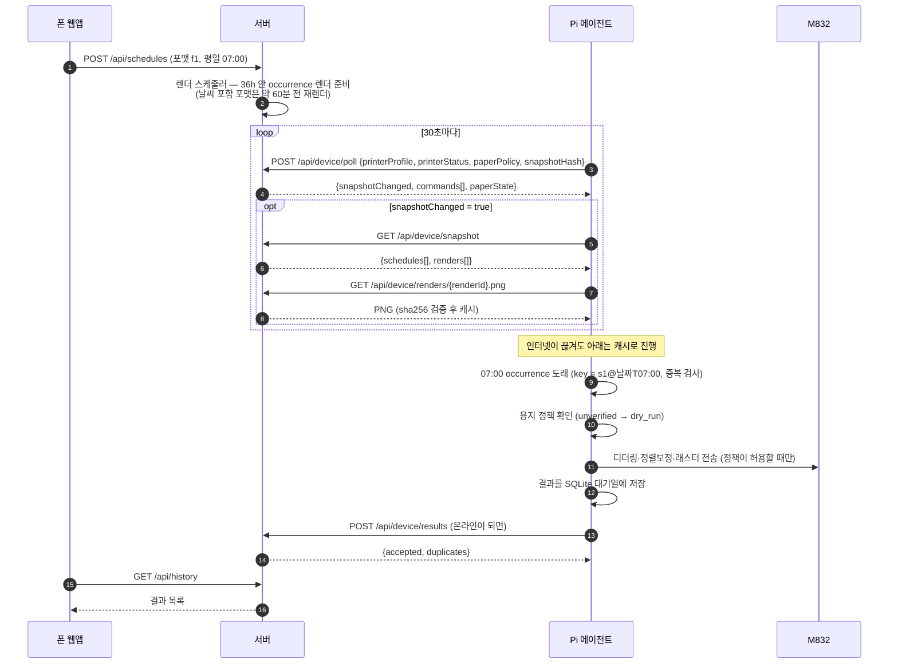

# 아키텍처

> 하루종이(Haru-Paper)의 전체 구조, 구성요소 경계, 도메인 모델, **API 규약 원본**, 동기화 흐름.
> 서버·Pi·앱 문서는 이 문서의 규약을 링크해서 쓰고, 다르게 정의하지 않는다. 규약을 바꾸면 이 문서를 먼저 고친다.
> 최초 결정 근거는 [`init_plan.md`](init_plan.md) (2·6·7절).
>
> 표기: **[확인됨]** 실물 확인 / **[확인됨·코드]** 코드에서 직접 확인 / **[미검증]** 확인 전 / **[추정]** 자료 기반 추론 / **[기본값]** 따로 묻지 않고 정한 값(바꿔도 됨)

---

## 1. 전체 구조

```
폰 웹앱(PWA, s21) ─HTTPS(tailscale serve)─ 서버(justant-server2, Docker) ─30초 폴링─ Pi(Orange Pi Zero 2W) ─BT(SPP/RFCOMM)─ M832
                              (전 구간 Tailscale 내부망)
```
> 폴링이 기본 채널이다. 서버 → Pi SSE 깨우기 채널(선택, 4.3절)은 폴링 간격을 줄이는 보조 장치일 뿐 폴링을 대체하지 않는다 — `[미검증]`.

| 구성 | 디렉터리 | 하는 일 | 모르는 것 |
|---|---|---|---|
| 앱 | `/app` | 로그인·계정, 포맷 편집·미리보기, 예약, 지금 인쇄, 이력·기기 상태(토큰 발급·페어링) | 프린터 |
| 서버 | `/server` | 계정·세션, 포맷·예약 저장, 프린터 프로필 폭으로 PNG 렌더, 날씨, Pi 동기화 API | m832 프로토콜 |
| Pi | `/pi` | 폴링 동기화, 예약 로컬 계산, PNG 캐시, 디더링·정렬보정·래스터, 결과 대기열 | 레이아웃·콘텐츠 |

담당은 `justant-server2` 세션 하나다(`CLAUDE.md` "세션·담당").

### 1.1 경계 규칙

- **m832를 아는 코드는 `/pi/printer/m832`뿐이다.** 서버와 앱은 Pi가 보고한 [프린터 프로필](#35-프린터-프로필printer-profile)만 안다
- **서버가 그레이스케일 PNG를 렌더**한다. 좌우 정렬 보정, 헤드 폭 패딩, M832 헤더·꼬리 조립, 전송은 Pi(기기) 드라이버 몫이다. 흑백 변환(디더링)은 원칙적으로 기기 몫이지만, **2단계 MCU 기기(ESP32)를 위해 서버가 프로필 폭 기준 1-bpp(PBM P4)도 낸다**(3.4, 2026-09-17 사용자 승인) — 디더링은 프린터에 무관한 범용 처리이고, 프린터 명령·상수는 여전히 서버에 없다
- **스케줄 원본은 서버, 실행은 Pi**다. Pi는 예약 규칙과 렌더 PNG를 캐시해 두고 **인터넷이 끊겨도 스스로 인쇄**한다
- **포맷은 JSON 블록 + 화이트리스트 스타일 속성뿐**이다. 임의 HTML/CSS/JS는 받지 않는다(서버 Chromium의 SSRF·JS 실행 방지)

### 1.2 네트워크·배치

| 항목 | 값 |
|---|---|
| 서버 | `justant-server2` — Tailscale `100.81.189.92`, `justant-server2.tail2b65d1.ts.net` |
| 앱·Pi → 서버 | `https://justant-server2.tail2b65d1.ts.net` (`tailscale serve`로 HTTPS 종단). 포트·적용은 M2에서 사용자 승인 후 결정 |
| origin | 같은 origin. `/` = 웹앱 정적 파일, `/api` = Spring Boot |
| 인증 | 앱: **세션 로그인**(이메일/비밀번호, HttpOnly 쿠키 + CSRF, M6 — [`server/auth.md`](server/auth.md)). Pi: 기기별 `Authorization: Bearer <토큰>`(DB 해시, M6부터 서버 단일 토큰 아님) |
| 시간대 | `Asia/Seoul` 고정 |
| DB | MariaDB, 프로젝트 전용 컨테이너. 호스트 포트 노출 안 함 |

---

## 2. 구성요소 한눈에 보기

| 구성 | 스택 | 상세 문서 |
|---|---|---|
| Pi 에이전트 | Python 3.11 + venv, systemd `haru-paper-agent`, SQLite, pyusb / BT | [`pi/`](pi/README.md) |
| 서버 | Spring Boot 4 + Java 21 + Gradle(Groovy), MariaDB + Flyway, Playwright for Java + Chromium [기본값], Docker compose(prod) | [`server/`](server/README.md) |
| 웹앱 | React + TypeScript + Vite + PWA | [`app/`](app/README.md) |

---

## 3. 도메인 모델

### 3.1 포맷(Format) — 카드와 같은 것

- 인쇄물 한 장. 블록을 위에서 아래로 쌓아 만든다. 저장해 두고 여러 예약에서 재사용한다
- **가져오기(import)** 하면 내 라이브러리에 새 포맷이 생기고 `meta.forkedFrom`에 출처를 남긴다(fork). 이후 자유롭게 수정
- 단위는 **mm/pt** — 프린터 dpi와 무관하게 정의하고 렌더 시 프로필 dpi로 환산
- 전체 `style`과 블록별 `style`(각 슬롯의 `block.style`)을 분리 — 나중에 "내 스타일 입히기"를 스타일 덮어쓰기로 구현
- 첫 블록 타입: `text`, `image`, `dateHeader`, `weather`
- 텍스트 변수: `{{date}}`, `{{weekday}}` — 값은 렌더 대상 날짜(`targetDate`) 기준
- 이미지는 서버 내부에서 업로드 파일(`assetId`)로 저장하고, **내보내기 파일에만** `assets`에 data URI로 내장

요약 예시(**스키마 v2** — 행/슬롯. 2026-09-16 드래그 편집기 도입으로 v1의 평평한 `blocks` 배열에서 전환됐다. 서버는 v2만 저장·검증하고, v1 문서는 읽을 때 자동으로 v2로 up-convert한다):

```json
{
  "schemaVersion": 2,
  "meta": { "name": "아침 브리핑", "author": "justant", "description": "", "forkedFrom": null },
  "style": { "fontFamily": "Pretendard", "baseFontSizePt": 11, "lineHeight": 1.4,
             "marginMm": { "top": 3, "right": 3, "bottom": 8, "left": 3 }, "blockGapMm": 3, "divider": "none" },
  "rows": [
    { "id": "row-1", "slots": [
      { "id": "slot-1", "width": "1/1", "block": { "type": "dateHeader", "props": { "pattern": "YYYY년 M월 D일 dddd" }, "style": { "align": "center", "fontSizePt": 16, "bold": true } } }
    ] },
    { "id": "row-2", "slots": [
      { "id": "slot-2a", "width": "2/3", "block": { "type": "text", "props": { "text": "{{date}} {{weekday}}\n오늘의 할 일" }, "style": { "align": "left" } } },
      { "id": "slot-2b", "width": "1/3", "block": { "type": "weather", "props": { "fields": ["tempMin", "tempMax"] } } }
    ] },
    { "id": "row-3", "slots": [
      { "id": "slot-3", "width": "1/1", "block": { "type": "image", "props": { "assetId": "a1b2", "widthPercent": 100 } } }
    ] }
  ]
}
```

- **행(row)**: 순서 있는 배열, 1~30개. 각 행은 슬롯 1~2개.
- **슬롯(slot)**: 1슬롯 행은 폭 `"1/1"`만, 2슬롯 행은 `("1/2","1/2")`·`("2/3","1/3")`·`("1/3","2/3")` 조합만 허용. 슬롯마다 블록 정확히 1개(`null` 불가).
- 블록 타입·props·스타일 화이트리스트는 v1과 동일하다(`text`/`image`/`dateHeader`/`weather`).

> **스키마 상세(블록별 props, 스타일 화이트리스트, 검증 규칙, up-convert, 가져오기/내보내기 형식)의 원본은
> [`server/format-schema.md`](server/format-schema.md)다.** 이 절은 요약이다.

### 3.2 예약(Schedule)

```json
{ "id": "s1", "formatId": "f1", "type": "recurring", "daysOfWeek": ["MON","TUE","WED","THU","FRI"], "time": "07:00", "enabled": true }
{ "id": "s2", "formatId": "f2", "type": "once", "date": "2026-09-15", "time": "08:30", "enabled": true }
```

| 필드 | 설명 |
|---|---|
| `type` | `recurring`(요일 반복) 또는 `once`(일회성) |
| `daysOfWeek` | `recurring`일 때. `MON`~`SUN` |
| `date` | `once`일 때. `YYYY-MM-DD` (KST) |
| `time` | `HH:mm` (KST) |
| `enabled` | 켜기/끄기(휴가 중 일시정지) |

- 시간대는 `Asia/Seoul` 고정이라 필드로 두지 않는다
- 예약 1개 = 포맷 1개. 한 시각에 여러 장이 필요하면 예약을 여러 개 만든다
- 같은 규칙으로 서버(다음 실행 시각 표시·렌더 준비)와 Pi(실제 실행)가 **각자 occurrence를 계산**한다

### 3.3 occurrence와 명령(Command)

- **occurrence**: 예약 규칙이 만들어 내는 "한 번의 실행 시점"
- **occurrence key** = `{scheduleId}@{YYYY-MM-DD}T{HH:mm}` (예: `s1@2026-09-14T07:00`) — Pi가 계산.
  **같은 key는 두 번 인쇄하지 않는다**(재시작·재동기화 중복 방지)
- **명령(command)**: "지금 인쇄"는 예약이 아니라 명령이다. `{commandId, type: "print_now", formatId, renderId, sha256, paperConfirmed, createdAt}`.
  - 상태 [기본값]: `pending`(생성) → `delivered`(poll 응답에 처음 실림) → `done`(Pi 결과 수신). **생성 후 10분 안에 `done`이 안 되면 `expired`**
  - `done`/`expired`가 아닌 명령은 **매 poll 응답에 다시 실린다**(at-least-once). Pi는 **`commandId`로 중복을 거른다**
  - 만료 이유: Pi가 오프라인이었다가 몇 시간 뒤 접속했을 때 뜬금없이 인쇄되지 않게 하기 위해서다
  - **결과 업로드는 이미 `expired`인 명령도 `done`으로 덮어쓴다** [확인됨·코드: `ResultIngestService.ingestNew()` — `commandId`가 있는 결과를 받으면 명령의 현재 `status`를 보지 않고 무조건 `cmd.setStatus("done")`]. Pi가 자체 TTL로 뒤늦게 명령을 종결하고 결과를 올리면, 서버가 이미 만료 처리해 둔 명령이라도 `done`으로 되돌아간다 — 수용하는 비대칭이다. 앱 이력에는 Pi가 올린 결과의 `status`(`missed`/`failed`/`skipped_*`)가 그대로 남으므로, 명령 자체의 서버 내부 상태가 `done`으로 보이는 것보다 "왜 안 나왔는지"가 이력에 남는 쪽을 선택했다
  - **poll 응답의 `commands[]`는 호출한 기기의 소유자로 스코핑된다(2026-09-17 수정)** [확인됨·코드: `DeviceSyncService.processPoll()`, `CommandRepository.findAllByOwnerUserIdAndStatusIn`]. 예전에는 `commandRepository.findAllByStatusIn(...)`처럼 전역 조회라, 다른 사용자가 만든 "지금 인쇄" 명령이 이 기기의 poll 응답에도 실리는 소유권 경계 버그(IDOR류)였다.
  - 기기(`device_id`)가 아니라 **소유자(`owner_user_id`)** 로 거르는 이유: "지금 인쇄"는 기기 페어링 전에도 만들 수 있고(그때 `PrintNowController`가 `device_id`를 NULL로 둔다), `device_id`로 거르면 그 명령은 나중에 페어링해도 영영 전달되지 않고 10분 뒤 조용히 `expired`가 된다(앱에는 202만 뜨고 아무 일도 일어나지 않는다). V2의 `uk_devices_owner`(`owner_user_id` UNIQUE)가 1인 1기기를 보장하므로 소유자 스코핑은 기기 스코핑과 보안상 동등하다.
  - **만료 처리는 의도적으로 전역 스캔을 유지한다**(기기별로 스코핑하지 않는다) [확인됨·코드: `DeviceSyncService.poll()` 4단계]. 기기별로 하면 페어링만 되고 한 번도 poll하지 않은 기기의 명령이 영영 만료되지 않고 `pending`으로 남기 때문이다. 만료 처리는 명령의 `status`만 `expired`로 바꿀 뿐 다른 사용자에게 아무 내용도 노출하지 않으므로, 전역 스캔이어도 소유권 경계를 침범하지 않는다 — 위의 "commands[] 스코핑"과는 다른 비대칭이다.

### 3.4 렌더(Render)

```json
{ "renderId": "r9", "formatId": "f1", "targetDate": "2026-09-14", "profileKey": "m832-300-110-1300",
  "widthPx": 1300, "sha256": "…", "renderedAt": "2026-09-14T06:00:12+09:00" }
```

- PNG 파일 1개(그레이스케일, 폭 = 프로필 `printableWidthPx`, 높이는 내용에 따라 가변 — 110mm **연속 롤**)
- **1-bpp 출력(2단계 기기용, 2026-09-17 승인) [확인됨·코드]**: 같은 렌더를 **PBM P4**로도 제공한다. 폭·높이는 PNG와 동일, **1 = 검정, MSB-first**, 각 행은 바이트 경계로 패딩(`ceil(widthPx / 8)` 바이트/행), 흑백 변환은 서버 Floyd–Steinberg [기본값]. **좌우 정렬 보정(h-offset)·헤드 폭 패딩(1304dot)·M832 헤더·꼬리는 여전히 기기 몫**(1.1 경계 규칙). 스냅샷 `renders[]`에 `urlPbm`·`sha256Pbm`을 추가하되 **스냅샷 해시 계산에는 넣지 않는다** [기본값]. Pi는 당분간 PNG 경로를 그대로 쓰고, 같은 PBM으로 바꾸는 것은 선택 [기본값]. 구현: `PbmConverter`(`server/render`), 마이그레이션 `V3__render_pbm.sql`. 컴파일·기존 렌더 단위테스트 통과 확인, 실제 배포·기기 연동은 아직 [미검증]
- `profileKey` = `{model}-{dpi}-{paperWidthMm}-{printableWidthPx}` [기본값] — 프로필이 바뀌면 다시 렌더
- 서버는 **앞으로 36시간 안의 occurrence마다** `(formatId, targetDate)` 렌더를 준비한다
- 날씨처럼 바뀌는 블록이 있는 포맷은 occurrence **약 60분 전에 다시 렌더**한다
- "지금 인쇄" 명령을 만들 때 서버는 `targetDate = 오늘`로 즉시 렌더하고 그 `renderId`를 명령에 넣는다 [기본값]
- Pi는 실행 시 `(formatId, 오늘 날짜)` 렌더를 쓰고, 없으면 그 포맷의 **가장 최근 렌더**를 쓴다
- **알려진 한계(PoC 수용)**: 오프라인이 길어지면 날짜·날씨가 마지막으로 받은 렌더 값으로 인쇄된다

### 3.5 프린터 프로필(Printer Profile)

Pi가 매 poll마다 보고하고, 서버는 이 값으로만 렌더 폭을 정한다.

```json
{ "model": "m832", "dpi": 300, "paperWidthMm": 110, "printableWidthPx": 1300 }
```

| 필드 | 설명 |
|---|---|
| `model` | 표시용 모델명. 서버는 이 값으로 분기하지 않는다 |
| `dpi` | mm/pt → px 환산에 사용 |
| `paperWidthMm` | 용지 폭. PoC는 110 고정 |
| `printableWidthPx` | 서버 PNG 폭. **잠정 1300** — M1에서 detox-printer `07_print_image.py`(WIDTH_DOTS=1304, h-offset 2mm) 기준으로 확정, 근거는 [`pi/printer-m832.md`](pi/printer-m832.md) |

- Pi가 아직 한 번도 보고하지 않았으면 서버는 위 값을 기본 프로필로 쓴다 [기본값]
- PoC는 Pi 1대 = 프린터 1대 = 프로필 1개. 다른 프린터를 붙이면 `/pi/printer/<model>` 드라이버만 추가하고 서버·앱은 그대로
- **원본 조회 경로는 소유자별 하나뿐이다(2026-09-17)**: `PrinterProfileProvider.getCurrentProfile(ownerUserId)`. 인자 없이 "아무 기기나 하나" 고르던 예전 메서드는 멀티유저에서 틀린 답을 줄 수 있어 삭제됐다. `ownerUserId`가 `null`이거나 그 사용자의 기기가 없으면 DB 조회 없이 이 절 상단 값(DEFAULT)을 돌려준다. 렌더링(포맷 소유자), 렌더 정리 스케줄러(렌더를 만든 당시 소유자), 편집본 미리보기(요청한 로그인 사용자) 모두 이 조회를 각자의 소유자 기준으로 부른다 — [`server/rendering.md`](server/rendering.md) 참고

### 3.6 실행 결과(Result)

```json
{ "resultId": "3f0c…(uuid)", "occurrenceKey": "s1@2026-09-14T07:00", "commandId": null, "formatId": "f1", "renderId": "r9",
  "status": "printed", "detail": "", "scheduledAt": "2026-09-14T07:00:00+09:00", "executedAt": "2026-09-14T07:00:03+09:00" }
```

- `resultId`는 **Pi가 발급**(UUID). 업로드는 `resultId`로 멱등
- `occurrenceKey`와 `commandId` 중 정확히 하나가 값을 가진다
- `scheduledAt`은 명령일 때 명령 생성 시각 [기본값]

| `status` | 의미 |
|---|---|
| `printed` | 프린터로 전송 완료 |
| `dry_run` | 용지 정책 `unverified`라 전송하지 않고 기록만 |
| `missed` | 유예 시간(30분) 안에 실행하지 못함 |
| `failed` | 전송 중 오류(detail에 예외 원문) |
| `skipped_no_paper` | 용지 없음(상태 조회 또는 수동 상태가 꺼짐) |
| `skipped_clock_unsynced` | 시계 미동기(오프라인 재부팅 등)로 보류 |
| `skipped_printer_offline` | 프린터 연결 안 됨 |

### 3.7 용지 정책(Paper Policy)

Pi의 `HARU_PAPER_POLICY`. 상세·현재값은 [`pi/policy.md`](pi/policy.md).

| 정책 | 언제 | 예약 실행 | 지금 인쇄 |
|---|---|---|---|
| `unverified` (기본) | 용지 감지(H4) 확정 전 | `dry_run` 기록만 | `paperConfirmed=true`일 때만 전송 |
| `status_query` | H4 통과 후 | 인쇄 직전 상태 조회로 용지 확인 | 동일 |
| `manual_flag` | H4 실패 시 폴백 | 서버의 수동 "용지 장착됨"이 켜져 있을 때만 | 동일 |

- **최종 판단은 Pi가 한다.** 서버·앱의 체크박스와 수동 상태는 Pi에 전달되는 입력일 뿐이다
- `manual_flag`에서 프린터 오류(`failed`, `skipped_printer_offline`) 결과가 올라오면 서버가 수동 상태를 자동으로 끈다 [기본값]

---

## 4. API 규약 v0 (원본)

### 4.1 공통

| 항목 | 규칙 |
|---|---|
| 경로 | 모두 `/api` 아래 |
| 본문 | `application/json; charset=utf-8` (업로드·PNG 제외) |
| 시각 | ISO-8601 오프셋 포함 `2026-09-14T07:00:00+09:00`. 날짜 `YYYY-MM-DD`, 시:분 `HH:mm`은 KST |
| ID | 서버 리소스 ID는 서버 발급 문자열. `resultId`만 Pi 발급 UUID |
| 오류 | `application/problem+json` (Spring `ProblemDetail`, RFC 9457/7807): `{type, title, status, detail, instance}` + 확장 `errors: [{path, message}]` (검증 오류일 때). HTTP 400/401/403/404/409/413/415/422/500 [기본값]. 상태별 의미·예시는 [`server/api.md`](server/api.md) 4절 |
| 인증 | 앱용 경로는 **세션 로그인 필요**(예외: `/api/health`, `/api/auth/signup`, `/api/auth/login`, `POST /api/device/pair`는 무인증). `/api/admin/**`는 ADMIN 역할 추가 필요. **Pi용 4개 경로**(`poll`, `snapshot`, `renders`, `results`)만 Bearer 필수 — `/api/device`, `/api/device/paper-state`는 세션 인증(앱용)이므로 경로 접두사가 아니라 **경로별로** 판단한다. 상세는 [`server/auth.md`](server/auth.md) |

### 4.2 앱용 (M6부터 세션 인증 — 예외 표시)

| 메서드 | 경로 | 용도 | 인증 |
|---|---|---|---|
| POST | `/api/auth/signup` | 가입 `{email, password, handle, displayName}` | 없음 |
| POST | `/api/auth/login` | 로그인 `{email, password}` → 세션 쿠키 | 없음 |
| POST | `/api/auth/logout` | 로그아웃 | 세션 |
| GET | `/api/auth/me` | 현재 사용자 | 세션 |
| PATCH | `/api/account` | 프로필·비밀번호 변경 | 세션 |
| GET/POST | `/api/formats` | 목록(내 것만) / 생성 | 세션 |
| GET/PUT/DELETE | `/api/formats/{id}` | 조회 / 수정 / 삭제(소유자 아니면 404) | 세션 |
| POST | `/api/formats/import` | 내보낸 JSON 가져오기(fork) | 세션 |
| GET | `/api/formats/{id}/export` | `assets` 내장 JSON 내보내기 | 세션 |
| GET | `/api/formats/{id}/preview.png` | 저장된 포맷을 현재 프린터 프로필로 미리보기 렌더 | 세션 |
| POST | `/api/formats/preview` | **저장하지 않은 편집본** 미리보기 렌더 [기본값] | 세션 |
| POST | `/api/assets` | 이미지 업로드(최대 10MB) → `assetId` | 세션 |
| GET | `/api/assets/{assetId}` | 업로드 원본 이미지(소유자만, 편집기 썸네일용) [기본값] | 세션 |
| GET/POST | `/api/schedules` | 목록(내 것만) / 생성 | 세션 |
| PUT/DELETE | `/api/schedules/{id}` | 수정(켜기/끄기 포함) / 삭제 | 세션 |
| POST | `/api/print-now` | `{formatId, paperConfirmed}` → 명령 생성 | 세션 |
| GET | `/api/history` | 실행 결과 목록(내 것만) | 세션 |
| GET | `/api/device` | Pi 마지막 폴링 시각, 프린터 프로필·상태, 용지 정책, 수동 용지 상태 | 세션 |
| PUT | `/api/device/paper-state` | `{loaded}` — H4 실패 시 폴백용 수동 상태 | 세션 |
| GET/PATCH | `/api/devices/me` | 기기 요약 조회 / 이름 변경 | 세션 |
| POST | `/api/devices/me/token` | 기기 토큰 발급·재발급(평문은 1회만 응답) | 세션 |
| POST | `/api/devices/pairing-codes` | 10분 유효 1회용 페어링 코드 생성 | 세션 |
| POST | `/api/device/pair` | `{code, printerProfile?}` → 기기 토큰 발급(Pi가 부름). `printerProfile`은 선택 필드(JSON 문자열)로, 주면 그대로 저장된다 | **없음**(코드 자체가 1회용 비밀) |
| GET/PUT | `/api/settings` | 날씨 기본 위치 등(사용자별) | 세션 |
| GET | `/api/admin/users` 등 | 사용자 관리([`server/auth.md`](server/auth.md) 6절) | ADMIN |
| GET | `/api/health` | 헬스체크 | 없음 |

기기 토큰·페어링·계정·관리자 API의 요청·응답 필드, 세션·CSRF 메커니즘은 [`server/auth.md`](server/auth.md)가 원본이다. 아래 4.2절 나머지는 M2 시점부터 있던 도메인 API(포맷·예약·지금인쇄·이력·기기 상태·설정)만 다룬다.

#### 요청·응답 필드

**포맷**

| 요청 | 본문 | 응답 |
|---|---|---|
| `GET /api/formats` | — | `200 [{id, name, author, forkedFrom, hasDynamicBlocks, updatedAt}]` |
| `POST /api/formats` | 포맷 문서 `{schemaVersion: 2, meta, style, rows}` (`assets` 없음) | `201 {id, document, hasDynamicBlocks, createdAt, updatedAt}` |
| `GET /api/formats/{id}` | — | `200 {id, document, hasDynamicBlocks, createdAt, updatedAt}` |
| `PUT /api/formats/{id}` | 포맷 문서 | `200` 위와 같음 |
| `DELETE /api/formats/{id}` | — | `204`. 예약이 참조 중이면 `409` [기본값] |
| `POST /api/formats/import` | 내보내기 JSON(`assets` 포함) | `201 {id, document, …}` — `meta.forkedFrom = {name, author, schemaVersion, importedAt}`, `assets`는 업로드 파일로 풀어 `assetId` 재발급 |
| `GET /api/formats/{id}/export` | — | `200` 포맷 문서 + `assets: {assetId: "data:image/…;base64,…"}` |
| `GET /api/formats/{id}/preview.png?date=YYYY-MM-DD` | `date` 생략 시 오늘 | `200 image/png` (폭 = 현재 프로필 `printableWidthPx`) |
| `POST /api/formats/preview?date=YYYY-MM-DD` | 포맷 문서(저장 안 된 편집본, `assets` 없음) | `200 image/png` (폭 = 현재 프로필). **포맷·렌더 행을 만들지 않는다.** 검증 실패 `422` [기본값] |

- `hasDynamicBlocks`: 날씨처럼 렌더 시점에 따라 바뀌는 블록 포함 여부(서버 계산)
- 문서 검증 실패는 `422`, 규칙은 [`server/format-schema.md`](server/format-schema.md)

**에셋**

| 요청 | 본문 | 응답 |
|---|---|---|
| `POST /api/assets` | `multipart/form-data`, 필드 `file` (PNG/JPEG만 [기본값], 최대 10MB) | `201 {assetId, contentType, widthPx, heightPx, sizeBytes}`. 초과 시 `413`, 그 밖의 형식 `415` |
| `GET /api/assets/{assetId}` | — | `200 image/png` 또는 `image/jpeg` (업로드 원본). 없으면 `404` [기본값] |

**예약**

| 요청 | 본문 | 응답 |
|---|---|---|
| `GET /api/schedules` | — | `200 [{…Schedule, nextOccurrenceAt}]` |
| `POST /api/schedules` | `{formatId, type, daysOfWeek?, date?, time, enabled}` | `201 {…Schedule, nextOccurrenceAt}` |
| `PUT /api/schedules/{id}` | 위와 같음 | `200 {…Schedule, nextOccurrenceAt}` |
| `DELETE /api/schedules/{id}` | — | `204` |

- `nextOccurrenceAt`: 다음 실행 시각(없으면 `null` — 끝난 일회성, 꺼진 예약)

**지금 인쇄·이력**

| 요청 | 본문 | 응답 |
|---|---|---|
| `POST /api/print-now` | `{formatId, paperConfirmed}` | `202 {commandId, formatId, renderId, paperConfirmed, status: "pending", createdAt}` |
| `GET /api/history?limit=50&before=<executedAt>` | — | `200 [{…Result, formatName, source: "schedule" \| "command"}]` (최신순) |

- 명령 `status`: `pending` → `delivered` → `done`, 10분 안에 `done`이 안 되면 `expired` [기본값] ([3.3](#33-occurrence와-명령command))
- 서버는 `paperConfirmed=false`여도 **거절하지 않고 그대로 Pi에 전달**한다. 전송 여부는 Pi의 용지 정책이 판단한다(`unverified`면 Pi가 `skipped_no_paper`로 기록). 앱 UI는 체크를 요구한다

**기기·설정·헬스**

| 요청 | 본문 | 응답 |
|---|---|---|
| `GET /api/device` | — | `200 {deviceId, online, lastPollAt, agentVersion, printerProfile, printerStatus, paperPolicy, paperState}` |
| `PUT /api/device/paper-state` | `{loaded: true \| false}` | `200 {loaded, updatedAt, updatedBy: "app" \| "server"}` |
| `GET /api/settings` | — | `200 {weather: {label, lat, lon}}` |
| `PUT /api/settings` | `{weather: {label, lat, lon}}` | `200` 위와 같음 |
| `GET /api/health` | — | `200 {status: "ok", time}` |

- `online`: `lastPollAt`이 폴링 주기의 3배(90초) 이내면 `true` [기본값]
- `printerStatus`는 [4.3 poll 요청](#43-pi용-authorization-bearer-haru_device_token)의 `{state, detail}` 그대로, `paperPolicy`는 poll 요청의 최상위 `paperPolicy` 그대로
- `paperState`는 **어디서나 `{loaded, updatedAt, updatedBy}` 3필드 레코드 하나**(`DeviceDto.PaperState`)다 [확인됨·코드] — `GET /api/device` 응답과 poll 응답 모두 이 레코드를 쓰고, `@JsonInclude` 필터가 없어 `updatedBy`가 항상 직렬화된다(poll 응답에서는 `null`일 수 있음)
- `weather` 기본값: `{label: "서울시청", lat: 37.5663, lon: 126.9779}`

### 4.3 Pi용 (`Authorization: Bearer <기기별 토큰>`, DB 해시 — [`server/auth.md`](server/auth.md) 4절)

| 메서드 | 경로 | 용도 |
|---|---|---|
| POST | `/api/device/poll` | 30초마다. 요청: `{agentVersion, printerProfile, printerStatus, paperPolicy, snapshotHash}` / 응답: `{serverTime, snapshotHash, snapshotChanged, commands[], paperState, pollIntervalSec}` |
| GET | `/api/device/snapshot` | `snapshotChanged`일 때만. 응답: `{snapshotHash, schedules[], renders[{renderId, formatId, targetDate, sha256, url}]}` |
| GET | `/api/device/renders/{renderId}.png` | PNG 다운로드(sha256 검증) |
| GET | `/api/device/renders/{renderId}.pbm` | 같은 렌더의 1-bpp(PBM P4) 다운로드(`sha256Pbm` 검증). 2단계 기기용 — 3.4 [확인됨·코드] |
| POST | `/api/device/results` | 결과 묶음 업로드. `resultId`로 멱등. 명령 처리 완료도 여기서 보고 |
| GET | `/api/device/events` | SSE 상시 연결(선택). **깨우기 신호만** 싣는다 — 받으면 즉시 `POST /api/device/poll`을 한 번 더 한다. 명령 데이터·소유권 판정·중복 제거·TTL은 전부 poll 경로에 남는다. `[미검증]` — 코드는 있으나 실제 배포·tailscale serve 경유 스트리밍은 확인 전 |

#### 요청·응답 필드

**`POST /api/device/poll`**

요청:

```json
{
  "agentVersion": "0.1.0",
  "printerProfile": { "model": "m832", "dpi": 300, "paperWidthMm": 110, "printableWidthPx": 1300 },
  "printerStatus": { "state": "ok", "detail": "" },
  "paperPolicy": "unverified",
  "snapshotHash": "9f2c…"
}
```

- `printerStatus`: `{state, detail}`. `state`: `ok` | `offline` | `error` | `unknown` [기본값]. `detail`은 사람이 읽는 설명(없으면 빈 문자열)
  - H4(용지 감지) 통과 후 `no_paper`, `cover_open`을 추가할 예정이다
- `paperPolicy`: Pi의 `HARU_PAPER_POLICY` 값(`unverified` | `status_query` | `manual_flag`). **poll 요청의 최상위 필드**(`printerStatus` 안이 아님). 앱의 기기 화면 표시용 [기본값 — init_plan 7절 필드에 추가]
- `snapshotHash`: Pi가 마지막으로 받은 스냅샷 해시(서버가 준 문자열 그대로, 소문자 hex — 계산식은 [`server/api.md`](server/api.md) 6.1). 처음이면 `null`

응답:

```json
{
  "serverTime": "2026-09-14T06:59:30+09:00",
  "snapshotHash": "9f2c…",
  "snapshotChanged": false,
  "commands": [ { "commandId": "c7", "type": "print_now", "formatId": "f1", "renderId": "r12", "sha256": "…",
                  "paperConfirmed": true, "createdAt": "…" } ],
  "paperState": { "loaded": false, "updatedAt": "…", "updatedBy": null },
  "pollIntervalSec": 30
}
```

- `serverTime`: Pi 시계 이상 감지용. **시계 동기화 자체는 NTP**가 한다
- `commands`: `done`/`expired`가 아닌 명령 전부(at-least-once). Pi는 `commandId`로 중복 제거. **생성 후 10분이 지나 `expired`된 명령은 더 이상 싣지 않는다** [기본값]
  - 명령 렌더는 스냅샷 `renders`에 없을 수 있으므로, Pi는 명령의 `renderId`로 `GET /api/device/renders/{renderId}.png`를 받아 명령의 `sha256`으로 검증한다 [기본값]
- `pollIntervalSec`: 서버 `.env`의 `HARU_POLL_INTERVAL_SEC`(기본 30) 값 [기본값]. Pi는 응답에 값이 있으면 따르고, 응답이 없거나 오프라인이면 자기 `pi/.env`의 `HARU_POLL_INTERVAL_SEC`를 쓴다

**`GET /api/device/snapshot`**

```json
{
  "snapshotHash": "9f2c…",
  "generatedAt": "…",
  "schedules": [ { "id": "s1", "formatId": "f1", "type": "recurring", "daysOfWeek": ["MON"], "time": "07:00", "enabled": true } ],
  "renders": [ { "renderId": "r9", "formatId": "f1", "targetDate": "2026-09-14", "sha256": "…", "widthPx": 1300, "renderedAt": "…",
                 "url": "/api/device/renders/r9.png",
                 "urlPbm": "/api/device/renders/r9.pbm", "sha256Pbm": "…" } ]
}
```

- `schedules`: 꺼진 예약 포함 전체(`enabled`로 구분)
- `urlPbm`·`sha256Pbm`: 1-bpp 출력(3.4) [기본값, 확인됨·코드]. 스냅샷 해시에는 포함하지 않는다. V3 마이그레이션 이전 렌더는 둘 다 `null`
- `renders`: 예약이 참조하는 포맷마다 36시간 안 `targetDate` 렌더 + 포맷별 최신 렌더
- `snapshotHash`는 `schedules`와 `renders` 목록 내용의 해시

**`GET /api/device/renders/{renderId}.png`** — `200 image/png`. Pi는 snapshot의 `sha256`과 대조해 다르면 버리고 재시도

**`GET /api/device/renders/{renderId}.pbm`** — `200 image/x-portable-bitmap`(PBM P4, 3.4). 기기는 `sha256Pbm`으로 검증 [기본값, 확인됨·코드]. PBM이 없는 렌더(V3 이전)면 404

- **소유권 검사(2026-09-17 추가) [확인됨·코드: `DeviceSyncController.assertOwnership()`]**: `.png`·`.pbm` 둘 다 렌더의 `owner_user_id`와 폴링한 기기의 소유자가 다르면 **404**(존재 자체를 알리지 않는다 — `server/auth.md` 7절과 동일 원칙). 그 전에는 유효한 기기 토큰 하나로 남의 `renderId`(UUIDv4)만 알면 인쇄물 비트맵을 그대로 내려받을 수 있었다(IDOR). 렌더의 `owner_user_id`가 **NULL**(V4 백필 적용 전의 레거시 렌더, 또는 아직 claim되지 않은 레거시 포맷에서 파생된 렌더)이면 예외적으로 허용하고 경고 로그만 남긴다 — Pi가 상시 구동 중이라 백필 전에 전부 거부하면 운영이 끊긴다. V4 적용 + claim-legacy 이후에는 NULL이 0이 되므로 그 뒤의 NULL은 거부로 바꿀 예정(후속 과제, [`server/deploy.md`](server/deploy.md) 7절)

**`POST /api/device/results`**

```json
{ "results": [ { "resultId": "…", "occurrenceKey": "s1@2026-09-14T07:00", "commandId": null, "formatId": "f1", "renderId": "r9",
                 "status": "printed", "detail": "", "scheduledAt": "…", "executedAt": "…" } ] }
```

응답: `200 {"accepted": ["…"], "duplicates": ["…"]}` — 이미 받은 `resultId`는 `duplicates`로 돌려주고 성공 처리

**`GET /api/device/events`** — SSE 깨우기 채널(선택, `[미검증]`)

- 인증은 다른 4개 Pi 경로와 동일한 `Authorization: Bearer <기기별 토큰>`. 응답 `Content-Type: text/event-stream`
- 이벤트 형식: 연결 직후 `event: ready` 1회(Pi가 연결 성립·백오프 초기화 신호로 씀) → 이후 `event: wake` + `data: {"reason":"command"|"paperState"|"snapshot"}` 반복. 그 사이사이 `HARU_SSE_HEARTBEAT_SEC`(기본 15초)마다 SSE 주석(`:`)으로 하트비트
- 깨우기 트리거 3종:

  | 트리거 | reason |
  |---|---|
  | "지금 인쇄" 명령 생성(`POST /api/print-now`) | `command` |
  | 용지 상태 토글(`PUT /api/device/paper-state`) | `paperState` |
  | 예약·포맷·날씨 설정 변경(스냅샷이 바뀌는 모든 지점 — 기존 `RenderScanTrigger.requestScan()` 호출 지점과 동일 집합) | `snapshot` |

- **명령 전달·소유권 판정·중복 제거·TTL은 전부 기존 poll 경로에 그대로 남는다.** 이 채널은 wake 신호만 나르고, 신호를 받은 Pi는 `POST /api/device/poll`을 즉시 한 번 더 돈다
- 이벤트를 잃어도 손해는 최대 폴링 주기(30초)뿐이다 — 폴링은 계속 유지되고, 이 채널은 순수 지연 단축용 보조 장치다
- **`lastPollAt`/`online`은 SSE 연결로 갱신되지 않는다.** 그 값의 의미는 "poll을 완주해 프린터 프로필·상태가 실제로 갱신됐다"이고, SSE는 소켓이 열려 있다는 것만 증명한다
- 실패해도 안전: Pi가 404(서버가 옛 버전)나 401/403(토큰 문제)을 받으면 긴 간격(약 600초)으로 물러나 계속 재시도하되 폴링은 건드리지 않는다. `HARU_EVENTS_ENABLED=false`로 Pi에서 이 기능 자체를 끌 수 있다(폴링만으로 동작, 기존과 완전히 동일)
- **타임아웃 순서 불변식**(어긋나면 오류 없이 조용한 재연결 루프가 된다):

  ```
  서버 하트비트 15초 < Pi read 타임아웃 45초 < nginx proxy_read_timeout 90초 ≤ emitter 타임아웃 30분
  ```

- 아직 실물로 검증되지 않았다 — 코드는 있으나 `tailscale serve`를 통과하는 실제 스트리밍, nginx 설정 적용, Pi 배포는 사용자 승인 후 별도 단계다(`[미검증]`)

---

## 5. 동기화 흐름



**지금 인쇄**: 앱 `POST /api/print-now` → 서버가 오늘 날짜로 렌더·명령 생성 → SSE 이벤트로 즉시 깨우고(연결돼 있으면), 이벤트가 유실되거나 채널이 꺼져 있으면 최대 30초 →
Pi가 명령의 `renderId` PNG를 받아 `sha256` 검증·정책 확인 후 인쇄 → `results`로 `commandId` 보고(서버는 명령을 `done`으로). 10분 안에 `done`이 안 되면 `expired`.

---

## 6. 오프라인 동작과 알려진 한계

| 상황 | 동작 |
|---|---|
| 예약 시각에 인터넷·서버 끊김 | Pi가 캐시된 규칙·PNG로 인쇄, 결과는 대기열 → 복구 후 업로드 |
| 오프라인이 길어짐 | 날짜·날씨가 마지막으로 받은 렌더 값으로 인쇄됨(PoC 수용) |
| 오프라인 + 재부팅(정전) | RTC가 없어 시각을 모름 → NTP 동기 전까지 인쇄 보류(`skipped_clock_unsynced`). RTC(DS3231)는 선택 부품 |
| 예약 시각에 Pi 꺼짐·프린터 무응답 | 유예 30분 안에 60초 간격 재시도, 넘기면 `missed` |
| "지금 인쇄" 중 Pi 오프라인 | 명령은 서버에 남아 있다가 Pi가 다시 poll하면 받음. **단 생성 후 10분 안에 처리되지 않으면 `expired`**되어 인쇄되지 않음 |
| SSE 연결이 끊김 | 폴링이 그대로 보장선. 인쇄 동작·최대 지연 모두 변화 없음 |

정책 현재값의 원본은 [`pi/policy.md`](pi/policy.md).

---

## 7. 용어집

| 용어 | 뜻 |
|---|---|
| 포맷(Format) | 인쇄물 한 장의 정의. JSON 블록 + 스타일. 카드와 같은 말 |
| 블록(Block) | 포맷을 이루는 단위: `text`, `image`, `dateHeader`, `weather` |
| 가져오기/내보내기 | 포맷을 `assets` 내장 JSON 파일로 주고받기. 가져오면 fork(출처 기록) |
| 예약(Schedule) | 포맷을 언제 인쇄할지: `recurring`(요일+시각) / `once`(날짜+시각) |
| occurrence | 예약이 만들어 내는 한 번의 실행 시점. key = `{scheduleId}@{날짜}T{시각}` |
| 명령(Command) | "지금 인쇄" 요청. `commandId`로 식별 |
| 렌더(Render) | 포맷을 특정 `targetDate`·프로필로 그린 그레이스케일 PNG |
| 프린터 프로필 | Pi가 보고하는 `{model, dpi, paperWidthMm, printableWidthPx}`. 서버가 아는 프린터 정보의 전부 |
| 스냅샷(Snapshot) | Pi가 받아 캐시하는 예약 전체 + 렌더 목록. `snapshotHash`로 변경 감지 |
| 결과(Result) | 한 occurrence 또는 명령의 실행 결과. Pi 발급 `resultId`로 멱등 |
| 용지 정책 | 래스터 전송 전 용지 확인 방식: `unverified` / `status_query` / `manual_flag` |
| transport | Pi ↔ 프린터 전송 계층: `usb` / `bt` |

---

## 8. 향후 확장

**완료(M6)**: 계정·로그인, 기기별 토큰·페어링, 리소스 소유권 스코핑, 관리자 API — [`server/auth.md`](server/auth.md).

| 확장 | 방향 | 상태 |
|---|---|---|
| 레이아웃·위젯 엔진(M7) | 사용자 스크립트가 블록 JSON을 반환하는 샌드박스(`haru-widget-runner`, Node) | 포맷 스키마 v2(행/슬롯) 완료. 러너는 [미구현] — `.temp/03` 5절 |
| 작가·글·구독·피드(M8) | `@haru/posts` 위젯, RSS/Atom/JSON Feed 등록 | 미착수 — `.temp/03` 6절 |
| 위젯 에디터·마켓(M9) | `/studio/widgets/:id`, 게시·설치·업데이트 | 미착수 — `.temp/03` 7절 |
| 외부 공개(M10) | 공인 도메인 + TLS, Tailscale 밖 노출(사용자 승인 필요) | 미착수 — `.temp/03` 8절 |
| 다른 프린터 | `/pi/printer/<model>` 드라이버 추가 + 프로필 보고. 서버·앱·포맷(mm/pt 단위)은 그대로 | 미착수 |
| 실시간 동기화 | 상용화 시 poll을 WebSocket으로. Pi 에이전트는 "동기화 채널"을 인터페이스로 둔다 | 부분 — poll 보조 깨우기(SSE) 구현, poll을 완전히 대체하는 방향은 미착수 |
| 네이티브 앱 | `/app/android`, `/app/ios` 예약. 기술 미정(React Native/Expo, Kotlin+Swift, Flutter) — [`app/native.md`](app/native.md) | 미착수 |
| HTML 템플릿 포맷 | JS·네트워크를 완전히 차단한 샌드박스 렌더러가 생긴 뒤에만 재검토 | 보류 |
| 날씨 출처 | Open-Meteo → 기상청 단기예보로 교체 가능(출처 인터페이스 분리) | 미착수 |
| 푸시 알림 | 인쇄 실패·용지 없음 알림 | 미착수 |
